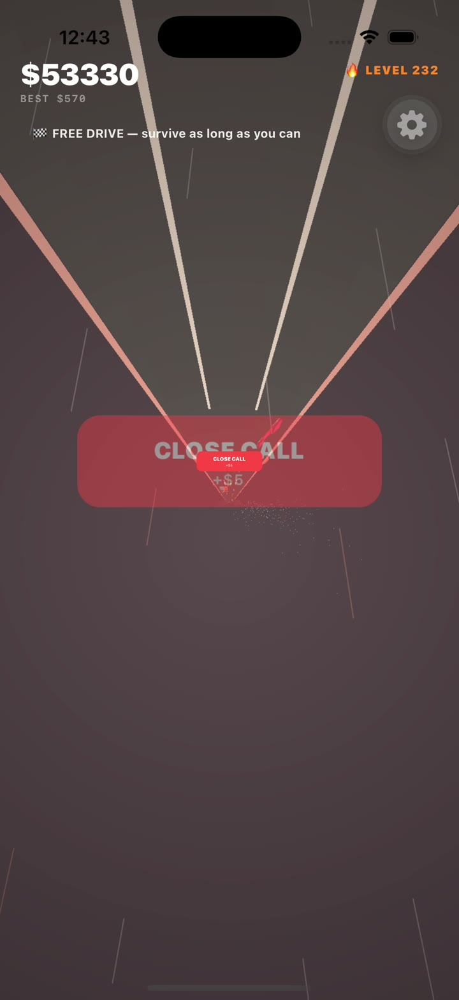
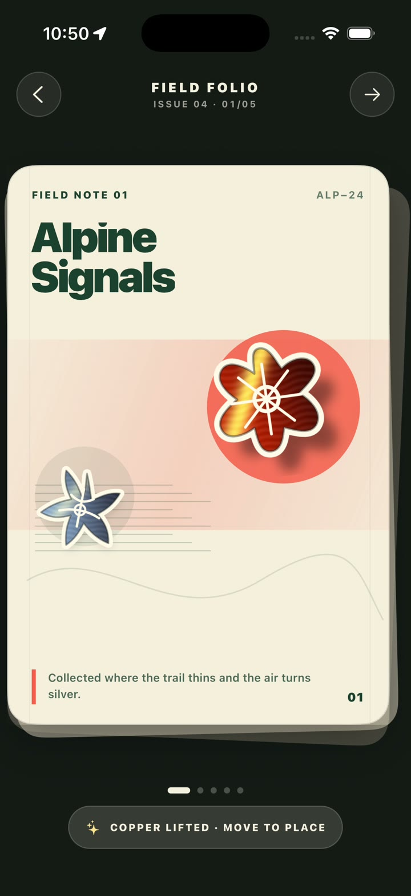
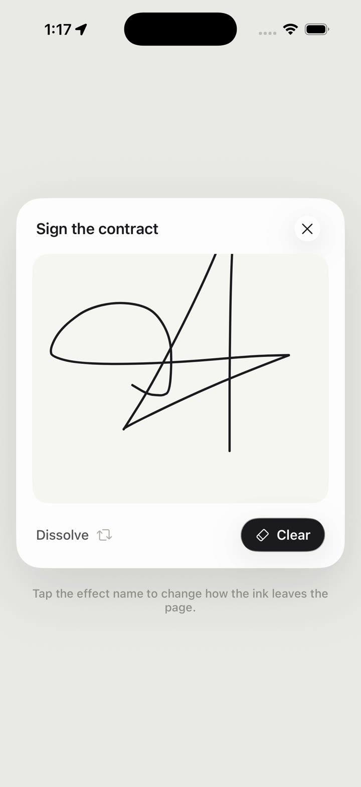

# Native Lab

Native Lab is a collection of focused React Native experiments: camera effects, tactile gestures,
Skia shaders, and small WebGPU worlds. Every experiment has a stable Expo Router route and an
isolated implementation so it can be studied, changed, or removed without understanding the
entire app.

This repository favors working prototypes with readable boundaries over a shared abstraction for
everything. The experiments are intentionally ambitious; several require an iOS development build
and recent hardware.

## Demo gallery

Click a preview to watch the complete interaction.

| Volcano Drive | Field Folio | Sign Off |
| --- | --- | --- |
| [](assets/demo/volcano-drive.mp4) | [](assets/demo/folio-shuffle.mp4) | [](assets/demo/sign-off.mp4) |
| [Watch gameplay](assets/demo/volcano-drive.mp4) | [Watch the folio interaction](assets/demo/folio-shuffle.mp4) | [Watch the signature effects](assets/demo/sign-off.mp4) |

## Explore the lab

| Experiment | What it demonstrates | Route | Platforms |
| --- | --- | --- | --- |
| [Sign Off](src/features/sign-off/README.md) | Gesture-driven signatures and eleven particle erasers | `/experiments/sign-off` | iOS, Android; web preview |
| [Field Folio](src/features/folio-shuffle/README.md) | Page physics and draggable metal stickers | `/experiments/folio-shuffle` | iOS, Android; web preview |
| [Halo Arena](src/features/halo-arena/README.md) | Interactive WebGPU stadium booking | `/experiments/halo-arena` | Native dev build |
| [Timberline](src/features/timberline/README.md) | A touch-controlled physics tower | `/experiments/timberline` | Native dev build |
| [Prism Field](src/features/prism-field/README.md) | Camera Control, motion, and native compositing | `/experiments/prism-field` | iOS dev build |
| [Relic Lift](src/features/relic-lift/README.md) | Vision subject extraction and Metal rendering | `/experiments/relic-lift` | iOS dev build |
| [Rain Lens](src/features/rain-lens/README.md) | Live camera frames processed with Skia | `/experiments/rain-lens` | Native dev build |
| [Volcano Drive](src/features/volcano-drive/README.md) | An endless-driving WebGPU game | `/experiments/volcano-drive` | Native dev build |

See the [feature index](src/features/README.md) for implementation entry points and runtime notes.

## Run locally

Prerequisites: a current Bun release, Xcode for iOS development builds, and the platform tooling
required by Expo.

```bash
bun install
bun start
```

Expo Go is useful for the gallery shell and lightweight universal UI. Camera integrations, local
Expo modules, and WebGPU experiments require a development build:

```bash
bun run ios
# or
bun run android
```

Run repository checks and verify that every route can be bundled for web before opening a pull
request:

```bash
bun run validate
bun run build:web
```

## Repository map

```text
src/app/          Expo Router screens; routes only
src/features/     one self-contained directory and README per experiment
src/components/   components shared by more than one route
src/data/         typed gallery metadata and route ownership
src/tw/           project styling primitives
modules/          local Expo modules for platform-specific capabilities
assets/           app artwork and attributed audio
docs/             architecture and maintenance notes
```

Route files should stay thin. A route configures navigation and renders one exported feature entry
point; state, rendering, shaders, and platform adapters belong under `src/features/<slug>`.

## Contributing

Start with [CONTRIBUTING.md](CONTRIBUTING.md), then read [docs/architecture.md](docs/architecture.md)
before adding a new experiment. Bug reports and narrowly scoped improvements are welcome. New
experiments should include a route, registry entry, and feature README in the same pull request.

## License

Code is available under the [MIT License](LICENSE). Audio under `assets/audio` is from Kenney's CC0
Interface Sounds pack; its license notice is stored beside the files.
